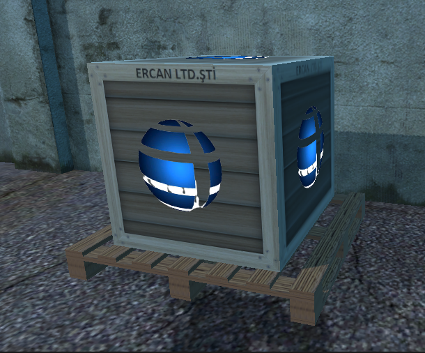
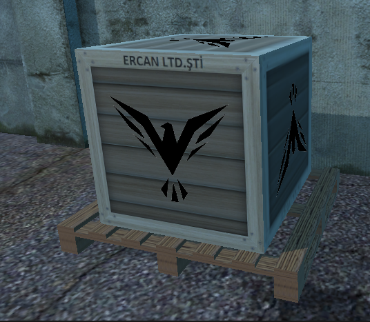
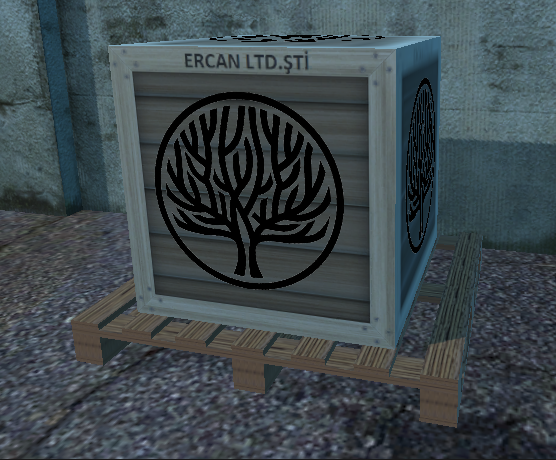
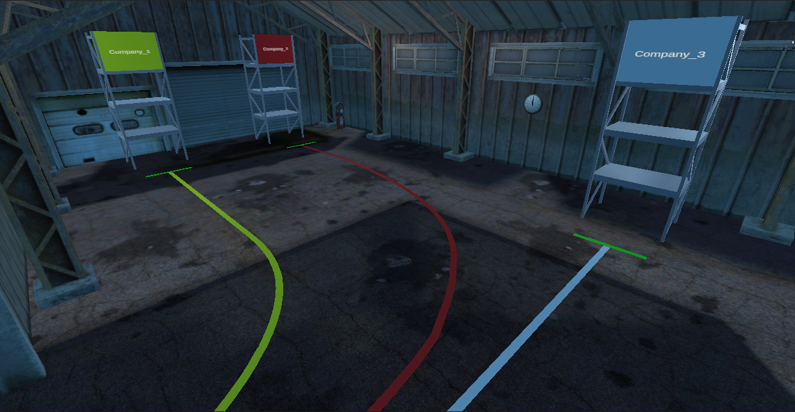
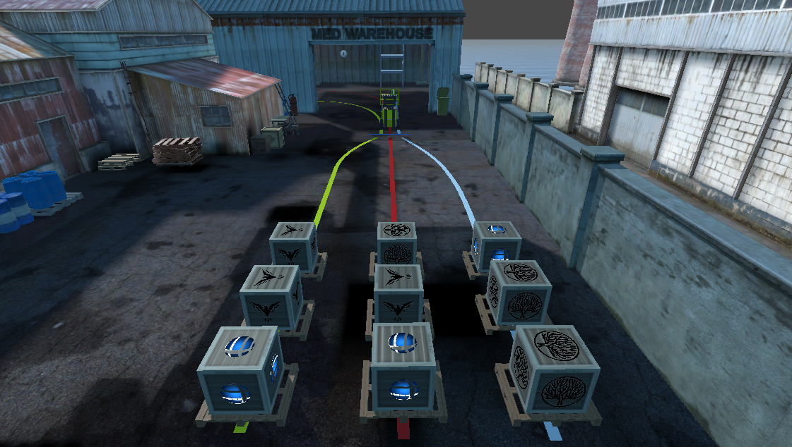
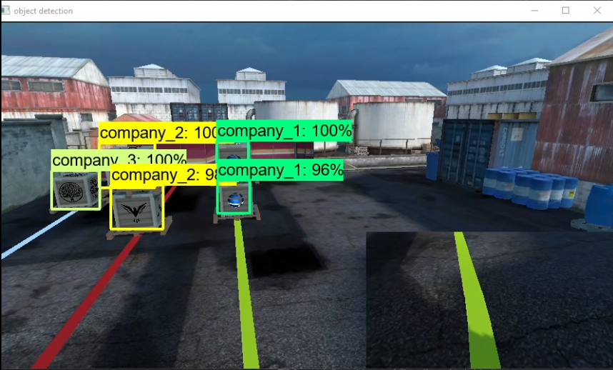

# This project contains forklift automation and stock control 
Used languages and tools: 
-Programming language: Python, C# 
-Framework: Darknet  Faster RCNN 
-Game Developement: Unity3D Game Engine 
-Image Processing: OpenCV 
## Video is available on youtube [Simulation Video Link](https://www.youtube.com/watch?v=nJC3Y_SUnbw)
There are the simulation and enviroment images: 

