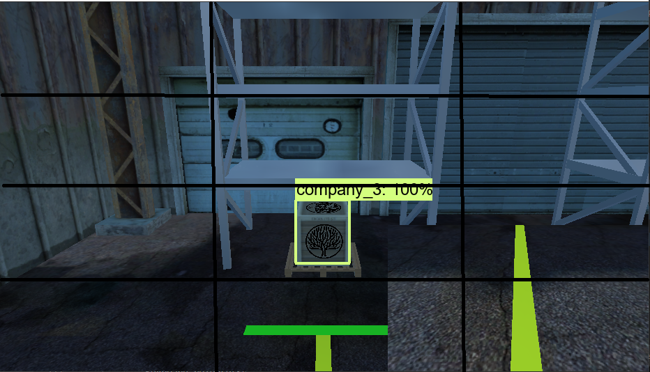

# This project contains forklift automation and stock control Used languages and tools:
Programming language: Python, C#
Framework: Darknet  Faster RCNN
Game Developement: Unity3D Game Engine
Image Processing: OpenCV
## Video is available on youtube [Simulation Video Link](https://www.youtube.com/watch?v=nJC3Y_SUnbw)
There are the simulation and enviroment images: 

